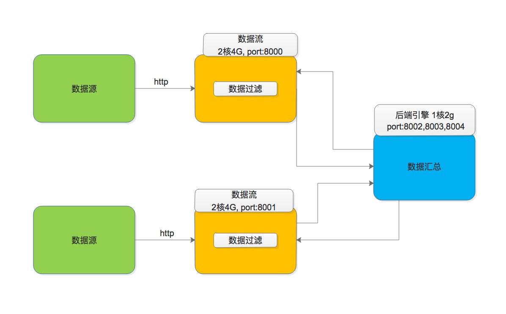
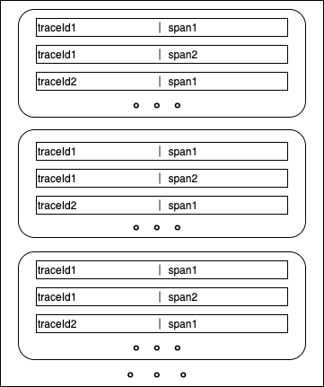
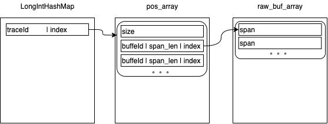

首届云原生编程挑战赛1：实现一个分布式统计和过滤的链路追踪
-----------------------------

### 赛题描述

数据
- 共有两个数据文件，分别位于不同的数据源（拉取数据源的容器被称为"前端"，此前端非彼前端）
- 每个数据文件是由一系列的 `span` 组成
- 每条 `span` 记录都有 `traceId`，每个 `traceId` 可对应多条 `span`
- 同一 `traceId` 下的所有 `span` 可来自于不同的数据源

目标
- 赛题中规定了哪些 `span` 是错误的
- 只要 `traceId` 下的某 `span` 出错了，就需要把该 `traceId` 下所有的 `span`（可来自不同的数据源） 提交给后端引擎，以实现链路追踪

评测
- 召回，能够把所有出错的链路追踪到
- 时间，越快越好

### 解题思路

为了能够获取到错误 `traceId` 对应的所有 `span` 必须使用缓存。
这有两点考虑：
- 首先保证同一数据源中的能够收集完整
- 再就是需要保证后端请求在另一数据源出错的 `traceId` 对应的所有 `span` 时能全部返回

由于同一 `traceId` 对应的 `span` 被规定在一定范围，所以可以做 **批量缓存**。
实现中每 20000 `span` 作为一批，并且依旧采用 demo 中给出的 "环形缓存" 形式。

所以，每批次的处理流程为：
1. 前端先拉取批量大小的数据；
2. 前端紧接着处理这批数据，然后并把处理得到的错误 `traceId` 上报给后端；
3. 后端在收到所有前端的同一批次的上报后，把所有错误 `traceId` 集合起来，再向前端请求它们对应的所有 `span`；
4. 前端响应后端的请求，响应完成后便可清空该批数据所占缓存。

上面概述了总体流程，接下来关注前端与后端的具体实现。需要考虑它们要用几个线程，要建立几个连接，连接的优化有哪些。。。
另外，需要注意的是：**前端与后端的处理单位是缓存中的批量数据**

前端实现：
- 一开始，拉取数据使用一个线程、处理数据使用一个线程、上报给后端使用一个线程、响应后端的请求使用一个线程
- 后面发现性能瓶颈在处理数据上，于是把数据的处理一份为二：先转成一条条 `span` 的形式，再去检查是否出错。这样相当于为处理数据又多配了一个线程，可使用另一闲置的处理器
- 这些线程的 **串联** 值得关注，在慢慢的摸索中发现：**`SynchronousQueue` 非常好用，能将它们串成一条流**（在 `SQ` 包用它写了一道经典面试题）
- 前端设计的连接有：与数据源的连接、上报给后端的专属连接、响应后端的专属连接
- 这些连接都是使用的阻塞IO（未尝试IO多路复用、非阻塞IO等技术是因为认为瓶颈不在次），并自己拼的报文格式
- tcp 的优化有：采用长连接，设置 `TcpNoDelay`

后端实现与前端类似，不再记录。

注，在解题过程中非常容易遗留 **JVM 调优（修改jvm参数）**！

### 结果

排53，进复赛了。但离大佬的 *2s真man* 的处理速度差远了！不过，拿T恤的目标达成了～～

### 别人为什么性能好

赛后复盘，看了 [这位小哥](https://github.com/wangkaish/ali_race2020_r1_tail_base) 的代码。

#### 1. 更优的缓存结构

从上图可以看到这是一种多级缓存：
- 第一级采用 `map` 形式，存储 `traceId` 对应的所有 `span` 的缓存在哪
- 第二级是一种数组形式，其每个元素中先存储了该元素中已经存了多少个 `span` 的索引，接下来依次存储的是 `span` 的索引
- 第三级便是 `span` 源数据

这三级缓存在代码入口便被初始化了，在运行过程中不会改变大小，这很大程度上减少了 GC 的负担。
细节上，`LongIntHashMap` 使用了 [hppc](https://github.com/carrotsearch/hppc) 减少了拆包、封包的内存消耗。
`pos_array` 使用的是 `ByteBuf`。而 `raw_buf_array` 使用的是 `ByteBuf[]`，这样可以直接从 `channel` 中把数据读到 `ByteBuf` 中。

总的来看，这种多级缓存相比于自己的缓存更高效地利用了内存。其几乎不会为 GC 带来负担，并且其存储时直接使用 byte（自己的转成了 String）减少了 CPU 和内存的消耗。

#### 2. 其他一些细节
- 在查找错误的 `traceId` 时直接使用 byte 匹配
- 两个前端的 "同步"（即使得发送至后端的步调一致）设计：以后端为桥梁。可通俗理解为，前端1到达某标志了，告诉后端，后端再转给前端2。前端2到达某标志时做类似操作。当两个前端发现它们彼此离的不太远时，才能继续前进。
- 使用了 `nio`
- 启动时尝试了代码预热（尽早触发 `jit`），大约能带来 200+ms 的提升

